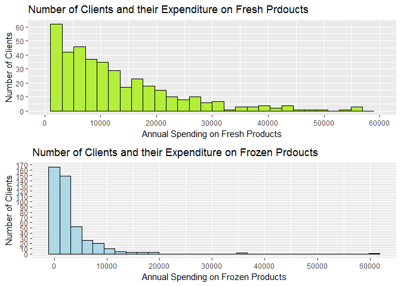
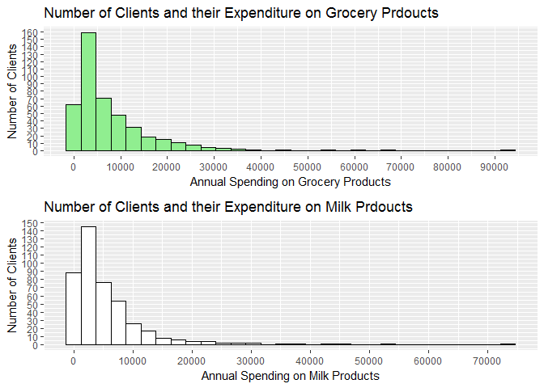
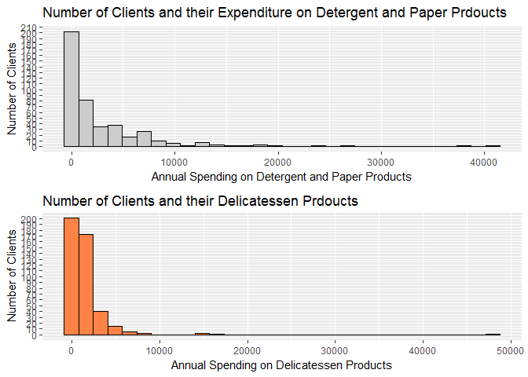
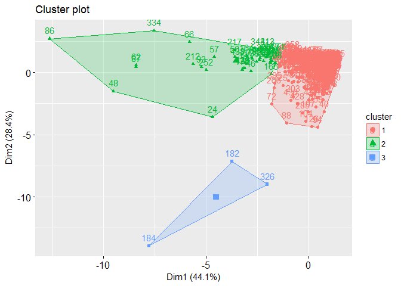
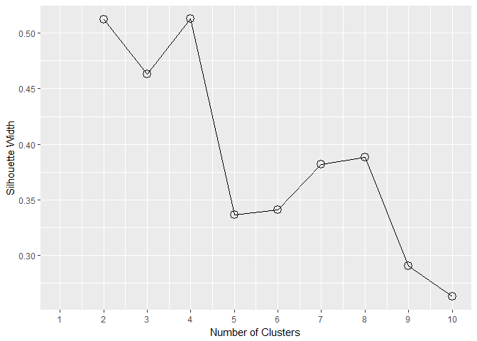
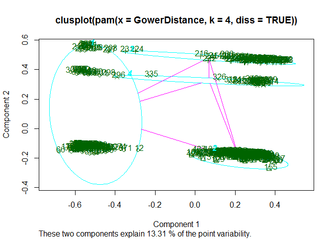
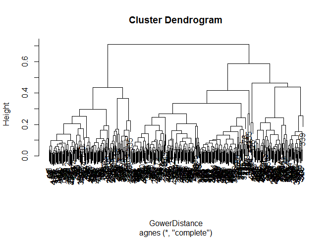
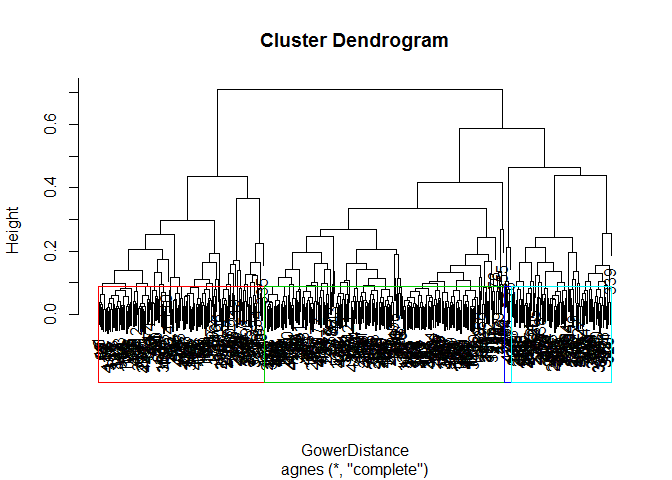
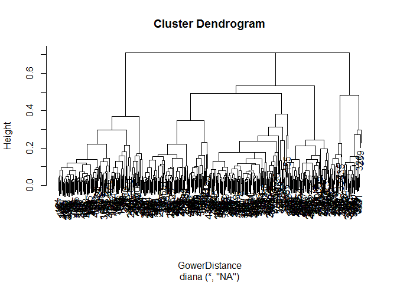
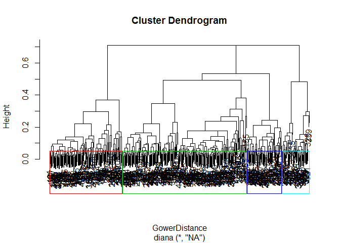

**Author:-** Nihit R. Save <br />
**Date:-** 21st April 2017 <br />

Dataset: <https://archive.ics.uci.edu/ml/datasets/Wholesale%20customers>

Data Exploration
=============================

Loading required packages and dataset.

``` r
library(cluster)

library(plyr)
library(dplyr)
```

``` r
train <- read.csv("Wholesale customers data.csv")
```

``` r
str(train)
```

    ## 'data.frame':    440 obs. of  8 variables:
    ##  $ Channel         : int  2 2 2 1 2 2 2 2 1 2 ...
    ##  $ Region          : int  3 3 3 3 3 3 3 3 3 3 ...
    ##  $ Fresh           : int  12669 7057 6353 13265 22615 9413 12126 7579 5963 6006 ...
    ##  $ Milk            : int  9656 9810 8808 1196 5410 8259 3199 4956 3648 11093 ...
    ##  $ Grocery         : int  7561 9568 7684 4221 7198 5126 6975 9426 6192 18881 ...
    ##  $ Frozen          : int  214 1762 2405 6404 3915 666 480 1669 425 1159 ...
    ##  $ Detergents_Paper: int  2674 3293 3516 507 1777 1795 3140 3321 1716 7425 ...
    ##  $ Delicassen      : int  1338 1776 7844 1788 5185 1451 545 2566 750 2098 ...

We notice that Channel and Region variables are set as integer and will convert them to factor during later stages.

``` r
summary(train)
```

    ##     Channel          Region          Fresh             Milk      
    ##  Min.   :1.000   Min.   :1.000   Min.   :     3   Min.   :   55  
    ##  1st Qu.:1.000   1st Qu.:2.000   1st Qu.:  3128   1st Qu.: 1533  
    ##  Median :1.000   Median :3.000   Median :  8504   Median : 3627  
    ##  Mean   :1.323   Mean   :2.543   Mean   : 12000   Mean   : 5796  
    ##  3rd Qu.:2.000   3rd Qu.:3.000   3rd Qu.: 16934   3rd Qu.: 7190  
    ##  Max.   :2.000   Max.   :3.000   Max.   :112151   Max.   :73498  
    ##     Grocery          Frozen        Detergents_Paper    Delicassen     
    ##  Min.   :    3   Min.   :   25.0   Min.   :    3.0   Min.   :    3.0  
    ##  1st Qu.: 2153   1st Qu.:  742.2   1st Qu.:  256.8   1st Qu.:  408.2  
    ##  Median : 4756   Median : 1526.0   Median :  816.5   Median :  965.5  
    ##  Mean   : 7951   Mean   : 3071.9   Mean   : 2881.5   Mean   : 1524.9  
    ##  3rd Qu.:10656   3rd Qu.: 3554.2   3rd Qu.: 3922.0   3rd Qu.: 1820.2  
    ##  Max.   :92780   Max.   :60869.0   Max.   :40827.0   Max.   :47943.0

Outliers are present in every product category and this must be due to very few clients buying in very large amounts.

Data Exploration using Graphs
=============================

``` r
library(ggplot2)
library(gridExtra)
p1 <- ggplot(train,aes(Fresh)) + geom_histogram(col = "black",fill="olivedrab2") + scale_x_continuous(breaks = seq(0,120000,10000),limits = c(0,60000)) + scale_y_continuous(breaks = seq(0,170,10)) + ylab("Number of Clients") + xlab("Annual Spending on Fresh Products") + ggtitle("Number of Clients and their Expenditure on Fresh Prdoucts") 

p2 <- ggplot(train,aes(Frozen)) + geom_histogram(col = "black",fill="lightblue") + scale_x_continuous(breaks = seq(0,60000,10000)) +ylab("Number of Clients") + scale_y_continuous(breaks = seq(0,190,10)) + ylab("Number of Clients") + xlab("Annual Spending on Frozen Products") + ggtitle("Number of Clients and their Expenditure on Frozen Prdoucts")

grid.arrange(p1,p2)
```



Even though the number of clients buying frozen products under 10,000 is much more, overall sale of fresh products is greater. This must be due to customers of the wholesale clients preferring to buy fresh products instead of frozen.

``` r
p3 <- ggplot(train,aes(Grocery)) + geom_histogram(col = "black",fill="lightgreen") +ylab("Number of Clients") + scale_x_continuous(breaks = seq(0,100000,10000)) +ylab("Number of Clients") + scale_y_continuous(breaks = seq(0,180,10)) + ylab("Number of Clients") + xlab("Annual Spending on Grocery Products") + ggtitle("Number of Clients and their Expenditure on Grocery Prdoucts")

p4 <- ggplot(train,aes(Milk)) + geom_histogram(col = "black",fill="white") + scale_x_continuous(breaks = seq(0,80000,10000)) +ylab("Number of Clients") + scale_y_continuous(breaks = seq(0,150,10)) + ylab("Number of Clients") + xlab("Annual Spending on Milk Products") + ggtitle("Number of Clients and their Expenditure on Milk Prdoucts")

grid.arrange(p3,p4)
```



The expenditure on milk and grocery products seems to be almost equal. This must be due to customers consuming these products on daily basis.

``` r
p5 <- ggplot(train,aes(Detergents_Paper)) + geom_histogram(col = "black",fill="gray80") + scale_x_continuous(breaks = seq(0,50000,10000)) +ylab("Number of Clients") + scale_y_continuous(breaks = seq(0,210,10)) + ylab("Number of Clients") + xlab("Annual Spending on Detergent and Paper Products") + ggtitle("Number of Clients and their Expenditure on Detergent and Paper Prdoucts")

p6 <- ggplot(train,aes(Delicassen)) + geom_histogram(col = "black",fill="sienna1") +ylab("Number of Clients") + scale_x_continuous(breaks = seq(0,50000,10000)) +ylab("Number of Clients") + scale_y_continuous(breaks = seq(0,200,10)) + ylab("Number of Clients") + xlab("Annual Spending on Delicatessen Products") + ggtitle("Number of Clients and their Delicatessen Prdoucts")

grid.arrange(p5,p6)
```



Expenditure on Detegent and Paper products as well as on Delicatessen products seem to be very less as compared to other categories. Also we can notice that all of the product categories are highly skewed. \#\# Tendency to Cluster

Let check the tendency of our dataset to cluster. This can me computed by Hopkins Statistic.

``` r
set.seed(123)
clustertend::hopkins(train,n = 100)
```

    ## $H
    ## [1] 0.06934606

We get Hopkins Statistic of 0.07 which very close to zero which rejects the null hypothesis that our dataset is uniformly distributed. Hence we can conclude that our dataset has meaningful clusters.

Before proceding lets convert the Channel and Region variables to factor

``` r
train$Channel <- factor(train$Channel,labels = c("HoReCa","Retail"))
train$Region <- factor(train$Region,labels = c("Lisbon","Oporto","Other"))
```

K-Means Clustering
=============================

Lets use K-Means clustering to cluster our dataset. K-Means Clustering uses Euclidean distance to assign data point to a cluster and therefore we cannot use categorical variables with it.

``` r
train2 <- train[,-c(1,2)]
```

We will standardize the dataset so that distance between variables is measured on same scale.

``` r
scaled_train <- scale(train2)
```

Determination of optimal number of clusters for K-Means
----------------------------------------------------------

We will use Gap Statistic to compute the optimal number of clusters.

``` r
GapStatistic <- clusGap(scaled_train,FUN = kmeans,K.max = 10)
GapStatistic
```

    ## Clustering Gap statistic ["clusGap"] from call:
    ## clusGap(x = scaled_train, FUNcluster = kmeans, K.max = 10)
    ## B=100 simulated reference sets, k = 1..10; spaceH0="scaledPCA"
    ##  --> Number of clusters (method 'firstSEmax', SE.factor=1): 3
    ##           logW   E.logW      gap     SE.sim
    ##  [1,] 5.646732 7.182959 1.536226 0.00967923
    ##  [2,] 5.492485 7.044454 1.551970 0.01048525
    ##  [3,] 5.390264 6.976545 1.586281 0.01042084
    ##  [4,] 5.341601 6.916587 1.574986 0.01127180
    ##  [5,] 5.205453 6.871611 1.666159 0.01131134
    ##  [6,] 5.175734 6.829645 1.653911 0.01094610
    ##  [7,] 5.109704 6.791603 1.681898 0.01147024
    ##  [8,] 5.079589 6.758675 1.679087 0.01210187
    ##  [9,] 5.025428 6.728843 1.703414 0.01162771
    ## [10,] 4.990360 6.702865 1.712505 0.01210038

We can see that the optimal number of clusters is 3 as determined by gap statistic.

``` r
Kmeanscluster <- kmeans(scaled_train,centers = 3,nstart = 25)
```

Interpretation of Clusters
---------------------------------

Lets visualize our clusters

``` r
library(factoextra)
fviz_cluster(Kmeanscluster,data = scaled_train)
```

 
It seems that majority of our observations are clustered in cluste 1 and 2 while cluster 3 has only 3 observations.

Lets compute the mean of each variable according to their clusters.

``` r
aggregate(train2, by = list(Cluster = Kmeanscluster$cluster), mean) %>% mutate(ClusterSize = Kmeanscluster$size)
```

    ##   Cluster     Fresh      Milk   Grocery    Frozen Detergents_Paper
    ## 1       1 12062.913  4115.099  5534.967  2940.677          1696.17
    ## 2       2  8129.341 19153.682 28894.909  1859.455         13518.25
    ## 3       3 60571.667 30120.333 17314.667 38049.333          2153.00
    ##   Delicassen ClusterSize
    ## 1   1299.115         393
    ## 2   2233.841          44
    ## 3  20700.667           3

Lets tabulate the above data so we get better understanding of it.
Average Expenditure on each Product Category by Clusters 

| Cluster	| Fresh| Milk | Grocery | Frozen | Detergent & Paper | Delicatessen |
| -------- | -------- | --------- | ------- | ------- | -------- | ----------- |
1|Medium | Low | Low | Medium | Low | Low |
2|Low | Medium | High | Low | High | Medium
3|High | High | Medium | High | Medium | High |


Partitioning around Medoids(PAM)
=============================

Now lets use cluster the dataset by including categorical variable too. For this we will convert the train dataset into Gower Dissimilarity Matrix which consists the measure of dissimilarity between data points. Also since the product categories are skewed we will log transform them.

``` r
GowerDistance <- daisy(train,metric = "Gower",type = list(logratio = 3:8))
```

    ## Warning in daisy(train, metric = "Gower", type = list(logratio = 3:8)):
    ## with mixed variables, metric "gower" is used automatically

``` r
summary(GowerDistance)
```

    ## 96580 dissimilarities, summarized :
    ##      Min.   1st Qu.    Median      Mean   3rd Qu.      Max. 
    ## 0.0089148 0.1424700 0.2260200 0.2309800 0.3099100 0.7087700 
    ## Metric :  mixed ;  Types = N, N, I, I, I, I, I, I 
    ## Number of objects : 440

Lets evaluate the most similar and unsimilar pair of data points so that we can determine if we have computed the dissimilarity matrix efficiently.

Most Similar Pair

``` r
GowerMatrix <- as.matrix(GowerDistance)
train[which(GowerMatrix == min(GowerMatrix[GowerMatrix != min(GowerMatrix)]),arr.ind = TRUE), ][1:2,]
```

    ##     Channel Region Fresh  Milk Grocery Frozen Detergents_Paper Delicassen
    ## 108  Retail  Other  8797 10646   14886   2471             8969       1438
    ## 64   Retail  Other  9396 11601   15775   2896             7677       1295

As we can see the categorical variables are same while the difference between expenditure on product categories is small.

Most Dissimilar Pair

``` r
train[which(GowerMatrix == max(GowerMatrix[GowerMatrix != max(GowerMatrix)]),arr.ind = TRUE), ][1:2,]
```

    ##     Channel Region Fresh  Milk Grocery Frozen Detergents_Paper Delicassen
    ## 252  Retail Lisbon  6134 23133   33586   6746            18594       5121
    ## 155  HoReCa  Other   622    55     137     75                7          8

Both the categorical variables are different while there is huge difference in expenditure of each product category.

Determining Optimal number of clusters
------------------------------------------

We will use average silhouette method to compute optimal number of clusters. The silhouette of a data point is a measure of how closely it is matched to data within its cluster and how loosely it is matched to data of the neighbouring cluster.

``` r
silhouette_width <- NA

for(i in 2:10){PAMcluster <- pam(GowerDistance,diss = TRUE, k = i) 
silhouette_width[i] <- PAMcluster$silinfo$avg.width}
```

``` r
ggplot(data = NULL,aes(x = 1:10,y =  silhouette_width)) + geom_line() + geom_point(shape = 1,size = 4) + scale_x_continuous(breaks = seq(1,10,1)) + xlab("Number of Clusters") + ylab("Silhouette Width")
```



Thus we can see that 2 or 4 is the optimal number of clusters. We will cluster the dataset into 4 clusters.

``` r
PAMfit <- pam(GowerDistance,diss = TRUE,k = 4)
```

Interpretation Of PAM clusters
-------------------------------------

``` r
clusplot(PAMfit,labels = 2)
```



The above plot displays all four clusters and the data points within them.

Lets check the medoids to which other data points are assigned

``` r
train[PAMfit$medoids,] %>% mutate(`Number of data points` = PAMfit$clusinfo[,1])
```

    ##   Channel Region Fresh  Milk Grocery Frozen Detergents_Paper Delicassen
    ## 1  Retail  Other  4389 10940   10908    848             6728        993
    ## 2  HoReCa  Other  6338  2256    1668   1492              311        686
    ## 3  HoReCa Lisbon  8885  2428    1777   1777              430        610
    ## 4  HoReCa Oporto  9155  1897    5167   2714              228       1113
    ##   Number of data points
    ## 1                   138
    ## 2                   211
    ## 3                    61
    ## 4                    30

Lets compute the summary statistics of each cluster

``` r
clusteredtrain <- train
clusteredtrain$Cluster <- PAMfit$clustering

result <- clusteredtrain %>% group_by(Cluster) %>% do(ClusterSummary = summary(.))
result$ClusterSummary
```

    ## [[1]]
    ##    Channel       Region        Fresh            Milk          Grocery     
    ##  HoReCa:  0   Lisbon: 16   Min.   :   18   Min.   : 1124   Min.   : 4523  
    ##  Retail:138   Oporto: 17   1st Qu.: 2326   1st Qu.: 6134   1st Qu.: 9580  
    ##               Other :105   Median : 5804   Median : 8156   Median :12650  
    ##                            Mean   : 8885   Mean   :10945   Mean   :16659  
    ##                            3rd Qu.:12230   3rd Qu.:12294   3rd Qu.:20372  
    ##                            Max.   :44466   Max.   :73498   Max.   :92780  
    ##      Frozen       Detergents_Paper   Delicassen         Cluster 
    ##  Min.   :  33.0   Min.   :  523    Min.   :    3.0   Min.   :1  
    ##  1st Qu.: 534.2   1st Qu.: 3876    1st Qu.:  566.8   1st Qu.:1  
    ##  Median :1067.5   Median : 5954    Median : 1339.0   Median :1  
    ##  Mean   :1512.8   Mean   : 7449    Mean   : 1751.8   Mean   :1  
    ##  3rd Qu.:1900.0   3rd Qu.: 8734    3rd Qu.: 2156.0   3rd Qu.:1  
    ##  Max.   :8132.0   Max.   :40827    Max.   :16523.0   Max.   :1  
    ## 
    ## [[2]]
    ##    Channel       Region        Fresh             Milk      
    ##  HoReCa:211   Lisbon:  0   Min.   :     3   Min.   :   55  
    ##  Retail:  0   Oporto:  0   1st Qu.:  3702   1st Qu.: 1188  
    ##               Other :211   Median :  9612   Median : 2247  
    ##                            Mean   : 13878   Mean   : 3487  
    ##                            3rd Qu.: 18821   3rd Qu.: 4205  
    ##                            Max.   :112151   Max.   :43950  
    ##     Grocery          Frozen      Detergents_Paper   Delicassen     
    ##  Min.   :    3   Min.   :   25   Min.   :   3.0   Min.   :    3.0  
    ##  1st Qu.: 1666   1st Qu.:  779   1st Qu.: 176.5   1st Qu.:  378.5  
    ##  Median : 2642   Median : 1960   Median : 375.0   Median :  823.0  
    ##  Mean   : 3887   Mean   : 3657   Mean   : 786.7   Mean   : 1518.3  
    ##  3rd Qu.: 4928   3rd Qu.: 4542   3rd Qu.: 948.5   3rd Qu.: 1582.0  
    ##  Max.   :21042   Max.   :36534   Max.   :6907.0   Max.   :47943.0  
    ##     Cluster 
    ##  Min.   :2  
    ##  1st Qu.:2  
    ##  Median :2  
    ##  Mean   :2  
    ##  3rd Qu.:2  
    ##  Max.   :2  
    ## 
    ## [[3]]
    ##    Channel      Region       Fresh            Milk          Grocery     
    ##  HoReCa:59   Lisbon:61   Min.   :  514   Min.   :  258   Min.   :  489  
    ##  Retail: 2   Oporto: 0   1st Qu.: 4155   1st Qu.: 1110   1st Qu.: 1677  
    ##              Other : 0   Median : 8656   Median : 2428   Median : 2824  
    ##                          Mean   :12706   Mean   : 3883   Mean   : 4072  
    ##                          3rd Qu.:18044   3rd Qu.: 5007   3rd Qu.: 5249  
    ##                          Max.   :56083   Max.   :23527   Max.   :16966  
    ##      Frozen      Detergents_Paper   Delicassen      Cluster 
    ##  Min.   :   91   Min.   :   5.0   Min.   :   7   Min.   :3  
    ##  1st Qu.:  982   1st Qu.: 240.0   1st Qu.: 375   1st Qu.:3  
    ##  Median : 2077   Median : 415.0   Median : 786   Median :3  
    ##  Mean   : 3253   Mean   : 947.9   Mean   :1215   Mean   :3  
    ##  3rd Qu.: 4686   3rd Qu.: 918.0   3rd Qu.:1693   3rd Qu.:3  
    ##  Max.   :18711   Max.   :5828.0   Max.   :6854   Max.   :3  
    ## 
    ## [[4]]
    ##    Channel      Region       Fresh            Milk          Grocery     
    ##  HoReCa:28   Lisbon: 0   Min.   :    3   Min.   :  333   Min.   : 1330  
    ##  Retail: 2   Oporto:30   1st Qu.: 5582   1st Qu.: 1062   1st Qu.: 2405  
    ##              Other : 0   Median : 9787   Median : 1560   Median : 3352  
    ##                          Mean   :11688   Mean   : 2245   Mean   : 4368  
    ##                          3rd Qu.:16906   3rd Qu.: 2304   3rd Qu.: 5308  
    ##                          Max.   :32717   Max.   :16784   Max.   :13626  
    ##      Frozen        Detergents_Paper   Delicassen        Cluster 
    ##  Min.   :  264.0   Min.   :  15.0   Min.   :  51.0   Min.   :4  
    ##  1st Qu.:  930.8   1st Qu.: 189.8   1st Qu.: 555.8   1st Qu.:4  
    ##  Median : 2696.5   Median : 341.5   Median : 883.0   Median :4  
    ##  Mean   : 5761.2   Mean   : 535.2   Mean   :1156.8   Mean   :4  
    ##  3rd Qu.: 4957.0   3rd Qu.: 709.0   3rd Qu.:1204.0   3rd Qu.:4  
    ##  Max.   :60869.0   Max.   :2208.0   Max.   :5609.0   Max.   :4

Hierarchical clustering
=============================


Agglomerative Nesting (AgNes)
---------------------------------------

Using Agglomerative Nesting Hierarchical Clustering

``` r
HCagnes <- agnes(GowerDistance,diss = TRUE,method = "complete")
plot(as.hclust(HCagnes))
```



AGNES considers every data point as cluster and then combines most similar clusters till only one cluster is left. Therefore we will specify the number of clusters it should stop clustering at.

``` r
clusteredtrain$AgnesCluster <- cutree(HCagnes,k = 4)
```

Checking the size of clusters.

``` r
table(clusteredtrain$AgnesCluster)
```

    ## 
    ##   1   2   3   4 
    ## 142 206   6  86

Our 3rd cluster has only 6 observations. We can try to prune dendogram with 3 clusters only but those 6 data points can be different and resemble different set of clients.

Lets visualize the dendogram with clusters.

``` r
plot(as.hclust(HCagnes))
rect.hclust(HCagnes, k = 4, border = 2:5)
```



Divisive Analysis Clustering (DiAna)
----------------------------------------------

While AGNES combines datapoints into clusters,DIANA divides entire dataset in to clusters until each datapoint is in its own cluster

``` r
HCdiana <- diana(GowerDistance,diss = TRUE)
plot(as.hclust(HCdiana))
```



As in AGNES, we will also need to prune dendogram of DIANA.

``` r
clusteredtrain$DianaCluster <- cutree(HCdiana,k = 4)
```

Checking the cluster size.

``` r
table(clusteredtrain$DianaCluster)
```

    ## 
    ##   1   2   3   4 
    ## 123 211  59  47

Lets see how our dendogram was pruned.

``` r
plot(as.hclust(HCdiana))
rect.hclust(HCdiana, k = 4, border = 2:5)
```



Thus we have clustered our dataset using various clustering methods like K-Means,PAM,AGNES and DIANA. The distributor can give promotional offers or discounts to his clients based on which cluster they belong.
